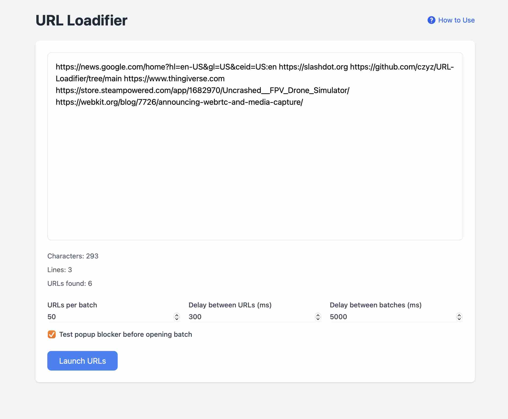

# URL Loadifier

A simple web tool that helps you open multiple URLs in new tabs with controlled timing. 

Use this tool to efficiently transfer tabs between devices or browsers. Export tabs to a text file from one device, then use URL Loadifier to reopen them on another. Supports both regular and incognito modes, with configurable timing to prevent browser overload. Successfully tested with 1200+ URLs.

## Features
- Open multiple URLs in batches
- Configurable delays between URLs and batches
- Popup blocker detection
- Works with URLs separated by spaces, newlines, or tabs
- Built with vanilla JavaScript and Tailwind CSS

## Usage
1. Visit the page
2. Paste your URLs into the text area
3. Adjust batch size and timing settings if needed
4. Click "Launch URLs" to begin

## Browser Support
- Chrome
- Firefox
- Safari
- Edge

## Local Development
1. Clone the repository
2. Open `index.html` in your browser
3. No build process required - it's vanilla JS and Tailwind via CDN 